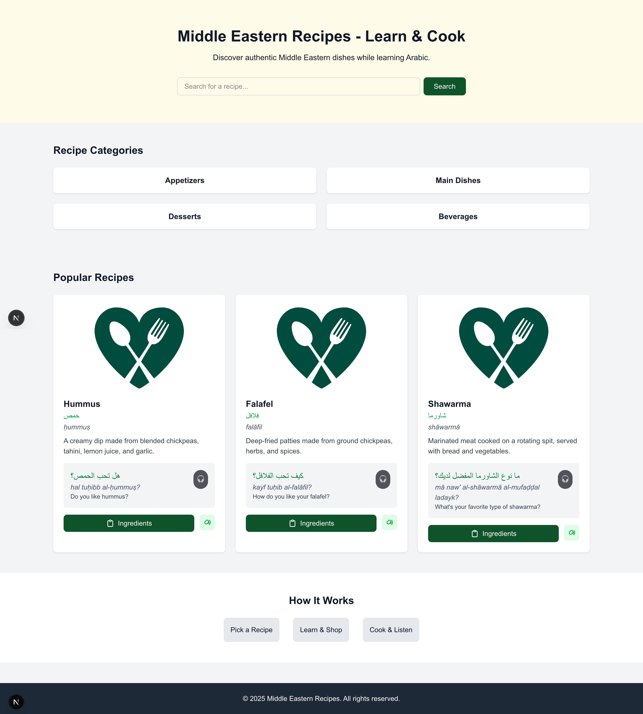
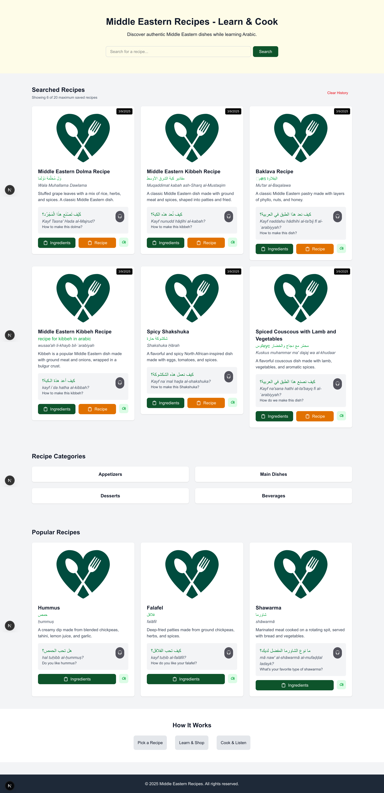

# README

## 🌟 App Introduction  
**Arabic Culinary Explorer** is an innovative application designed to help users learn and practice Arabic while exploring the rich culinary traditions of the Middle East. The app combines language learning with cooking by generating unique Arabic recipes and providing visual representations of the dishes. Whether you're a language enthusiast, a cooking lover, or both, this app offers a seamless and engaging experience.

## 🚀 Key Features  
- **Arabic Recipe Generation**: Create authentic Middle Eastern recipes with step-by-step instructions in both English and Arabic.  
- **Language Practice**: Learn Arabic vocabulary and phrases through cooking instructions and ingredient lists.  

## 🛠️ How It Works  
The app leverages a **local Language Model (LLM)** to process user inputs and generate unique recipes tailored to your preferences. It also integrates with an **image generation API** to create visual representations of the dishes. 
Here's how it works: 

1. **Input Your Dish**: Enter the name of the dish/recipe you want to see & click Search. The app will create a detailed recipe with instructions in both English and Arabic and show under "Searched Recipes" section. These recipes are save on your local storage. You can save maximum 20 recipes. There is also an option to clear history by clicking the 'Clear History' link.
2. **Learn Arabic**: Practice Arabic by reading & listening the recipe ingredients & instructions.

## 🛠️ Technologies Used  
- **Frontend**: React, Next.js, Tailwind CSS  
- **Backend**: Local LLM for recipe generation (local llama3 setup through Ollama) 
- **Image Generation**: Integration with an image-generation API (Local Stable Diffusion Setup)  
- **Language Support**: Arabic and English    

## 🏃‍♂️ How to Run
### Prerequisites  
- Node.js (v16 or higher)  
- npm, yarn, pnpm, or bun installed
- Local LLM running on port http://localhost:11434/ 
- Local Image generation model running on port http://127.0.0.1:7860 

### Run the app:
1. Navigate to the project directory.
2. Install the required dependencies.
3. Run the development server:

```bash
npm run dev
# or
yarn dev
# or
pnpm dev
# or
bun dev
```
### Open the App:  
Open [http://localhost:3000](http://localhost:3000) with your browser to see the app.





