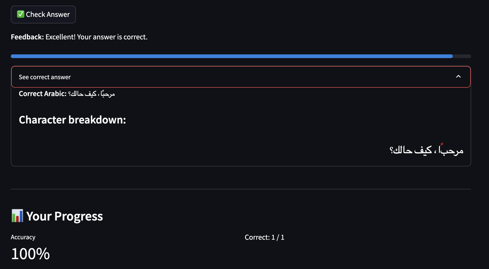

# Arabic Writing Practice App

A Streamlit application to practice writing Arabic language sentences. The app presents simple English sentences that users can translate to Arabic through typing, uploading images, or drawing.

## A Quick Look on What I build


## Features

- **Multiple Word Groups**: Practice with different categories like Greetings, Food, Family, and Travel
- **Multiple Input Methods**:
  - Type Arabic text directly
  - Upload images of handwritten Arabic
  - Draw Arabic text on a canvas
- **Evaluation and Feedback**: Get immediate feedback on your Arabic writing
- **Progress Tracking**: Track your learning progress
- **Virtual Arabic Keyboard**: Access Arabic characters easily
- **Learning Resources**: Links to helpful learning materials

## Technical Components

- **Streamlit**: For the user interface
- **Vision Encoder-Decoder Model**: For Arabic OCR (Optical Character Recognition)
- **Arabic Text Evaluation**: To assess the correctness of translations
- **Drawing Canvas**: For handwritten input

## Installation

### Quick Setup:
For a quick setup, you can run `python setup.py`. This will create a virtual environment, install dependencies, and offer to run the app.

### Manual Setup:

1. Create a virtual environment (recommended):
```sh
python -m venv venv
source venv/bin/activate  # On Windows: venv\Scripts\activate
```

2. Install dependencies:
```sh
pip install -r requirements.txt
```

3. Run the Streamlit app:
```sh
streamlit run app.py
```

The application will open in your default web browser at `http://localhost:8501`.

## Project Structure

- `app.py`: Main Streamlit application
- `arabic_ocr.py`: Module for Arabic OCR and text evaluation
- `requirements.txt`: Dependencies

## App in Action

Type your answer using the Arabic Keyboard:


Check your answer & get instant feedback:



You can also upload an image with your answer:


## Experiments 
I tried to use OCR to detect the hand-written text but the the model couldn't detect the hand-written text.

Reference: `handwriting_test.py`

Output:


