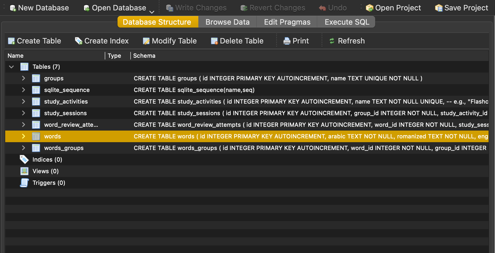
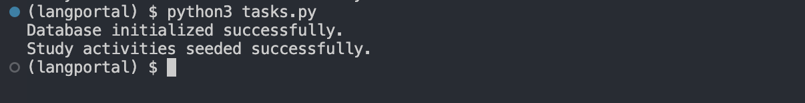
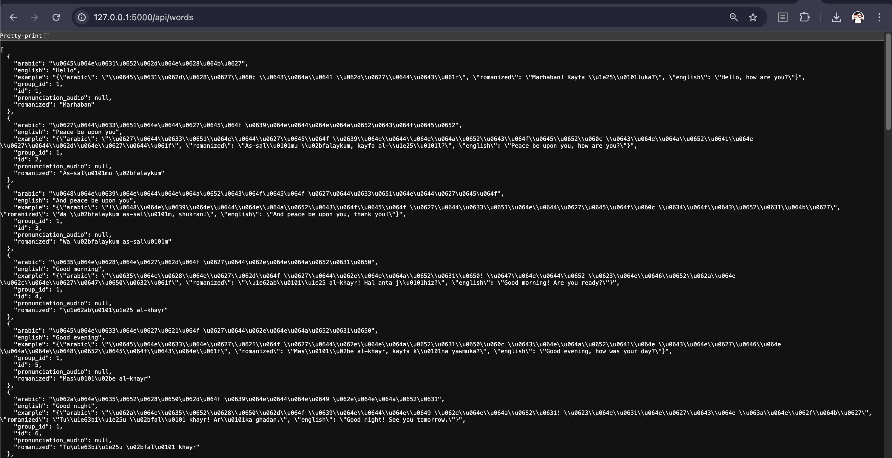

To design the backend using SQLite3 and Python Flask, follow these steps:

## Set Up a Virtual Environment
1. Inside the project directory, run:

```bash
conda create --name langportal
conda activate langportal
```

1. Create a file named `requirements.txt` & add following dependencies to the file :

```txt
flask
flask-cors
invoke
pytest==7.4.3
pytest-flask==1.3.0
```

Then install the dependencies:

```bash
pip install -r requirements.txt
```

---

## Set Up SQLite3 Database

### Set Up Your Folder Structure For Database
```
backend_flask/
|── db/
|   ├── config.py
|   ├── schema.py
|   ├── words.db # actual database containing the words
│── db/lib/ 
│   ├── db.py # Database connection and helper functions
│── db/sql/ 
|   ├── setup.sql  # SQL Schema for tables
│── db/seeds/ # Seed Data & Related Functions
│   ├── data_basic_greetings.json
|   ├── data_common_phrases.json
|   ├── data_verbs_beginner.json  
|   ├── groups.json 
|   ├── groups.py 
|   ├── helpers.py
|   ├── study_activities.json 
|   ├── study_activities.py
|   ├── words.py 
│── docs/
│   ├── business-requirements.md
|   ├── technical-requirements.md
|── images/
|── routes/
│── requirements.txt 
│── tasks.py  # Helper functions to initialize DB

```
### Define the Database Schema (db/sql/setup.sql)
```sql
CREATE TABLE IF NOT EXISTS groups (
  id INTEGER PRIMARY KEY AUTOINCREMENT,
  name TEXT UNIQUE NOT NULL
);

CREATE TABLE IF NOT EXISTS words (
  id INTEGER PRIMARY KEY AUTOINCREMENT,
  arabic TEXT NOT NULL,
  romanized TEXT NOT NULL,
  english TEXT NOT NULL,
  example JSON, -- Explanation of the word in English 
  group_id INTEGER NOT NULL,
  pronunciation_audio TEXT,  -- Optional: link to an audio file  
  FOREIGN KEY (group_id) REFERENCES groups(id) ON DELETE CASCADE
);

CREATE TABLE IF NOT EXISTS words_groups (
    id INTEGER PRIMARY KEY AUTOINCREMENT,
    word_id INTEGER NOT NULL,
    group_id INTEGER NOT NULL,
    FOREIGN KEY (word_id) REFERENCES words(id) ON DELETE CASCADE,
    FOREIGN KEY (group_id) REFERENCES groups(id) ON DELETE CASCADE
);

CREATE TABLE IF NOT EXISTS study_activities (
  id INTEGER PRIMARY KEY AUTOINCREMENT,
  name TEXT NOT NULL UNIQUE,  -- e.g., "Flashcards", "Quiz", "Typing Tutor", "Game"
  url TEXT NOT NULL,  -- The full url of the study activity
  preview_url TEXT    -- The url to the preview image for the activity
);

CREATE TABLE IF NOT EXISTS study_sessions (
    id INTEGER PRIMARY KEY AUTOINCREMENT,
    group_id INTEGER NOT NULL,
    study_activity_id INTEGER NOT NULL,
    start_time DATETIME DEFAULT CURRENT_TIMESTAMP,
    end_time DATETIME,  
    FOREIGN KEY (group_id) REFERENCES groups(id) ON DELETE CASCADE,
    FOREIGN KEY (study_activity_id) REFERENCES study_activities(id) ON DELETE CASCADE
);

```
### Set Up Config File 
Setup config file `config.py` to define folder paths 
```
import os

BASE_DIR = os.path.dirname(os.path.abspath(__file__))  # This is the 'db' folder
DATABASE = os.path.join(BASE_DIR, "words.db")  # Store database directly inside 'db/'
SEED_DIR = "seeds"
```

### Set Up the Schema File 
Schema file `schema.py` will initialze the database using SQL schema.
```py
import sqlite3
import os
from .config import DATABASE


def init_db():
    """Creates database tables from SQL schema."""
    # Ensure 'db' directory exists
    db_dir = os.path.dirname(DATABASE)
    if not os.path.exists(db_dir):
        os.makedirs(db_dir)

    conn = sqlite3.connect(DATABASE)
    with open("db/sql/setup.sql", "r") as f:
        conn.executescript(f.read())
    conn.commit()
    conn.close()
    print(f"Database initialized successfully at {DATABASE}.")

```

### Set Up the Database Helper function (db/lib/db.py)
Create a database connection helper in lib/db.py:
```py
import sqlite3

DATABASE = "words.db"


def get_db():
    conn = sqlite3.connect(DATABASE)
    conn.row_factory = sqlite3.Row  # Enables dictionary-like access to rows
    return conn
```

### Initialize the Database (tasks.py)

1. Write a script to initialize the database:
```py
from db.schema import init_db

if __name__ == "__main__":
    init_db()
```
2. Run below command:
```
python3 tasks.py
```
You'll see a message on your terminal: `Database initialized successfully.` and a `words.db` file will be created. You can also connect with the newly created database on any SQLite DB tool.



### Define Seed Data for Study Activities
1. Create a file named db/seeds/study_activities.json and add the following data:
```json
[
  {
    "name": "Typing Tutor",
    "url": "http://localhost:8080",
    "preview_url": "/assets/study_activities/typing-tutor.png"
  }
]

```
### Add Seed Data for Study Activities
1. Write a script to populate study data into the study_activities table
```py
import sqlite3
import json
from ..config import DATABASE


def seed_study_activities():
    """Inserts initial data into the study_activities table."""
    conn = sqlite3.connect(DATABASE)
    cursor = conn.cursor()

    with open("db/seeds/study_activities.json", "r") as f:
        study_activities = json.load(f)

    for activity in study_activities:
        cursor.execute(
            "INSERT INTO study_activities (name, url, preview_url) VALUES (?, ?, ?)",
            (activity["name"], activity["url"], activity["preview_url"]),
        )

    conn.commit()
    conn.close()
    print("Study activities seeded successfully.")

```
1. Modify tasks.py to insert study_activities seed data:
```py
from db.schema import init_db
from db.seeds.study_activities import seed_study_activities

if __name__ == "__main__":
    init_db()
    seed_study_activities()
```
2. Run the Seeding Script
```sh
python3 tasks.py
```

This will:

1. Create the `study_activities` table (if not exists).
2. Populate it with the data from `seed/study_activities.json`.

### Verify the data
Run the following SQLite command to check if the data is inserted:
```sh
sqlite3 words.db "SELECT * FROM study_activities;"

```

Similary define the seed data & related funcions for words & group update tasks to call seed data function.

## Set Up Falsk
### Setup Folder Structure
backend_flask/
│── app.py  # Main Flask application
│── routes/
│   ├── groups.py  # Group routes
│   ├── study_activities.py  # Study activity routes
|   ├── study_sessions.py  # Study activity routes
│   ├── words.py  # Word routes

### Create the Flask App (app.py)
Create app.py and set up Flask:

```py
from flask import Flask
from routes.study_activities import study_activities_bp
from routes.words import words_bp
from routes.groups import groups_bp

app = Flask(__name__)

# Register Blueprints
app.register_blueprint(study_activities_bp, url_prefix="/api")
app.register_blueprint(words_bp, url_prefix="/api")
app.register_blueprint(groups_bp, url_prefix="/api")

if __name__ == "__main__":
    app.run(debug=True)

```
### Define Routes (routes/words.py)
GET /api/words → List of all words
GET /api/words/<int:word_id> → Get a specific word by ID

```py
from flask import Blueprint, jsonify, request
from db.lib.db import get_db

words_bp = Blueprint("words", __name__)


@words_bp.route("/words", methods=["GET"])
def get_all_words():
    db = get_db()
    words = db.execute("SELECT * FROM words").fetchall()
    db.close()
    return jsonify([dict(word) for word in words])


@words_bp.route("/words/<int:word_id>", methods=["GET"])
def get_word(word_id):
    db = get_db()
    word = db.execute("SELECT * FROM words WHERE id = ?", (word_id,)).fetchone()
    db.close()
    return jsonify(dict(word)) if word else ("Not Found", 404)
```
### Define Routes for Groups
GET /api/groups → List of all word groups
GET /api/groups/<int:id> → Get a specific group by ID
GET /api/groups/<int:id>/words → Get all words belonging to a specific group
```py
from flask import Blueprint, jsonify, request
from db.lib.db import get_db

groups_bp = Blueprint("groups", __name__)

# GET /api/groups → List of all word groups
@groups_bp.route("/groups", methods=["GET"])
def get_all_groups():
    db = get_db()
    groups = db.execute("SELECT * FROM groups").fetchall()
    db.close()
    return jsonify([dict(group) for group in groups])

# GET /api/groups/<int:id> → Get a specific group by ID
@groups_bp.route("/groups/<int:id>", methods=["GET"])
def get_group(id):
    db = get_db()
    group = db.execute("SELECT * FROM groups WHERE id = ?", (id,)).fetchone()
    db.close()
    return jsonify(dict(group)) if group else ("Not Found", 404)

# GET /api/groups/<int:id>/words → Get all words belonging to a specific group
@groups_bp.route("/groups/<int:id>/words", methods=["GET"])
def get_group_words(id):
    db = get_db()
    words = db.execute("SELECT * FROM words WHERE group_id = ?", (id,)).fetchall()
    db.close()
    return jsonify([dict(word) for word in words])
```

### Define Routes for Study Activities
GET /api/study-activities → List of all study activities
GET /api/study-activities/<int:id> → Get a specific study activity by ID

```py
# routes/study_activities.py
from flask import Blueprint, jsonify, request
from lib.db import get_db

study_activities_bp = Blueprint("study_activities", __name__)

@study_activities_bp.route("/study-activities/<int:id>", methods=["GET"])
def get_study_activity(id):
    db = get_db()
    activity = db.execute("SELECT * FROM study_activities WHERE id = ?", (id,)).fetchone()
    db.close()
    return jsonify(dict(activity)) if activity else ("Not Found", 404)

@study_activities_bp.route("/study-activities/<int:id>/sessions", methods=["GET"])
def get_activity_sessions(id):
    # Placeholder for session retrieval logic
    return jsonify({"message": "Study sessions for activity " + str(id)})

```
### Define routes for study sessions
GET	/study-sessions	→ List all study sessions (supports filtering by `group_id` or `study_activity_id`)
GET	/api/study-sessions/<id> → Retrieve a specific study session
POST	/study-sessions	→ Start a new study session
PATCH	/study-sessions/<id> → Mark a study session as completed
DELETE	/study-sessions/<id> →  Delete a study session

### **1️ GET `/api/study-sessions` → List all study sessions**
- List all study sessions (supports filtering by `group_id` or `study_activity_id`)

**Example Request:**  
```http
GET /api/study-sessions
GET /api/study-sessions?group_id=1
GET /api/study-sessions?study_activity_id=2
```
**Example Response:**  
```json
[
    {
        "id": 1,
        "group_id": 1,
        "study_activity_id": 2,
        "start_time": "2024-02-12 10:00:00",
        "end_time": "2024-02-12 11:00:00"
    },
    {
        "id": 2,
        "group_id": 2,
        "study_activity_id": 3,
        "start_time": "2024-02-12 12:00:00",
        "end_time": null
    }
]
```
**Testing the Endpoint:**
```sh
curl http://127.0.0.1:5000/api/study-sessions 
curl "http://127.0.0.1:5000/api/study-sessions?group_id=1"
curl "http://127.0.0.1:5000/api/study-sessions?study_activity_id=3"

```
### **2️ GET `/api/study-sessions/<int:id>` → Get a specific study session**
- Fetches details of a single study session by ID.
- If found, it returns the session as JSON with 200 OK.
- If not found, it returns {"error": "Study session not found"} with 404 Not Found.

**Example Request:**  
```http
GET /api/study-sessions/1
```
**Example Response:**  
```json
{
    "id": 1,
    "group_id": 1,
    "study_activity_id": 2,
    "start_time": "2024-02-12 10:00:00",
    "end_time": "2024-02-12 11:00:00"
}
```
**Testing the Endpoint:**
```
curl http://127.0.0.1:5000/api/study-sessions/3
```

### **3️ POST `/api/study-sessions` → Start a new study session**
_ Accepts group_id and study_activity_id from the request body.
- Inserts a new study session into the database.
- `start_time` is set automatically unless provided.
- Returns the newly created session with a 201 Created status.

**Example Request:**  
```http
POST /api/study-sessions
Content-Type: application/json

{
    "group_id": 1,
    "study_activity_id": 2
}
```
**Example Response:**  
```json
{
    "id": 3,
    "group_id": 1,
    "study_activity_id": 2,
    "start_time": "2024-02-12 14:00:00",
    "end_time": null
}
```

**Testing the Endpoint**
```sh
curl -X POST http://127.0.0.1:5000/api/study-sessions \
     -H "Content-Type: application/json" \
     -d '{"group_id": 1, "study_activity_id": 2}'

```

### **4️⃣ PATCH `/api/study-sessions/<int:id>` → End a study session**
- Checks if the session exists.
- Updates `end_time` to the current timestamp to mark a session as completed.
- Returns the updated study session.

**Example Request:**  
```http
PATCH /api/study-sessions/1
Content-Type: application/json

{
    "end_time": "2024-02-12 11:00:00"
}
```
**Example Response:**  
```json
{
    "id": 1,
    "group_id": 1,
    "study_activity_id": 2,
    "start_time": "2024-02-12 14:30:00",
    "end_time": "2024-02-12 15:00:00"
}
```
**Testing the Endpoint:**
```
curl -X PATCH http://127.0.0.1:5000/api/study-sessions/1
```

---

### **5️ DELETE `/api/study-sessions/<int:id>`** → Delete a study session
- Checks if the session exists.
- Removes a study session by ID.
- Returns a confirmation message.

**Example Request:**  
```http
DELETE /api/study-sessions/1
```
**Example Response:**  
```json
{
    "message": "Study session deleted successfully."
}
```
**Testing the Endpoint:**
```sh
curl -X DELETE http://127.0.0.1:5000/api/study-sessions/3
```

## **6 GET /api/study-sessions/latest** → List latest study session detail
**Example Request:**  
```http
GET /api/study-sessions/latest
```
**Example Response:**  
```json
{
  "end_time": null,
  "group_name": "Basic Greetings",
  "id": 2,
  "start_time": "2025-02-13 03:58:18"
}
```
**Testing the Endpoint:**
```sh
curl "http://127.0.0.1:5000/api/study-sessions/latest"
```

## **7 GET /api/groups/<int:group_id>/study-sessions** → List all sessions for a specific group. TODO

## **8 GET `/api/study-activities/<int:activity_id>/study-sessions`** → List sessions for a specific study activity. TODO


## Run the Flask App
Start the server:
```
python3 app.py
```
Your API is now running at `http://127.0.0.1:5000`.



---

## Test the Endpoint
```
curl http://127.0.0.1:5000/api/words
curl http://127.0.0.1:5000/api/words/5
curl http://127.0.0.1:5000/api/groups
curl http://127.0.0.1:5000/api/groups/1
curl http://127.0.0.1:5000/api/groups/1/words
curl http://127.0.0.1:5000/api/study-activities
curl http://127.0.0.1:5000/api/study-activities/1
curl http://127.0.0.1:5000/api/study_sessions
curl http://127.0.0.1:5000/api/study-sessions/3
curl http://127.0.0.1:5000/api/study-sessions 
curl "http://127.0.0.1:5000/api/study-sessions?group_id=1"
curl "http://127.0.0.1:5000/api/study-sessions?study_activity_id=3"
curl "http://127.0.0.1:5000/api/study-sessions/latest
```

### **Next Steps**
- Implement `GET /dashboard/stats`


