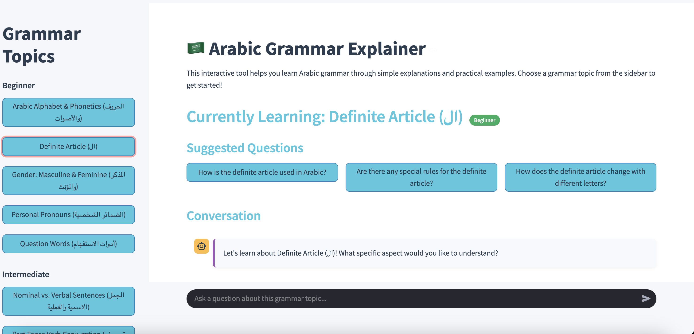
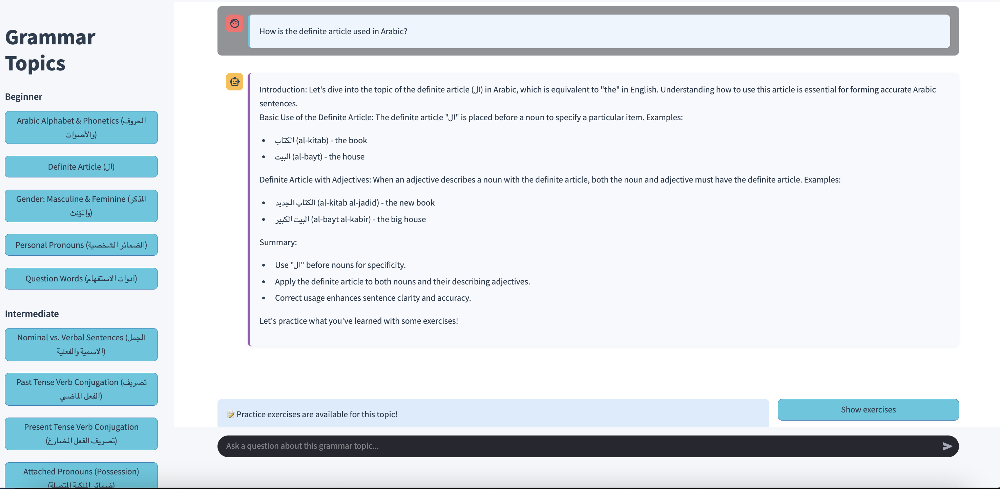
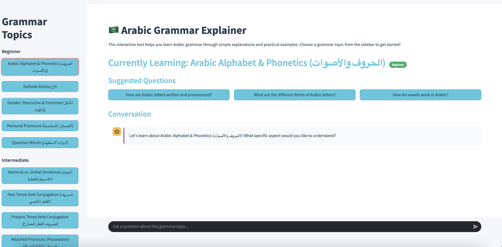
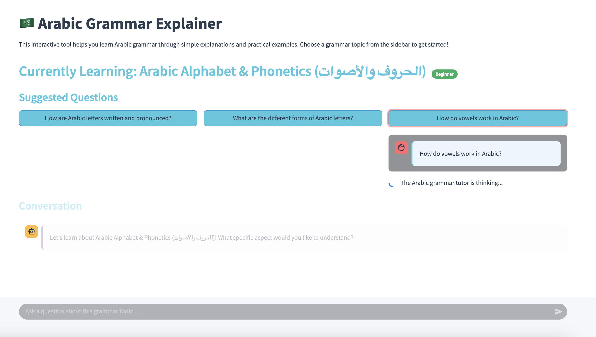
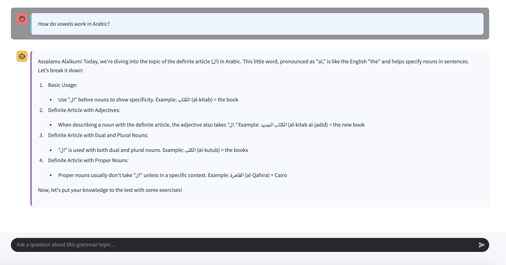
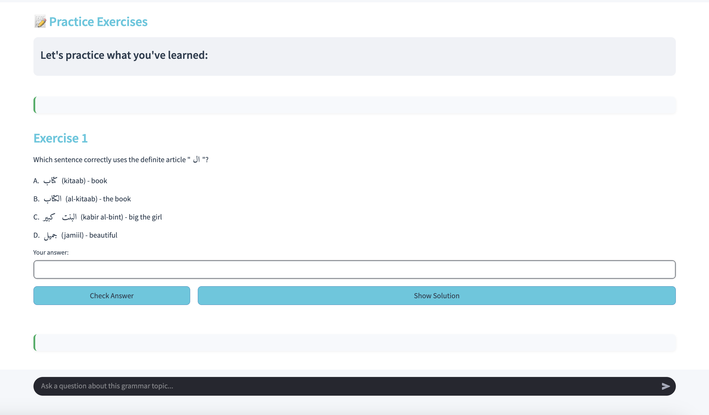
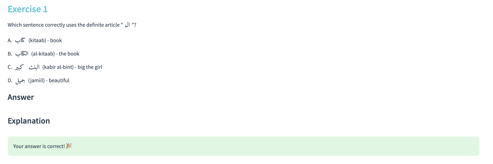
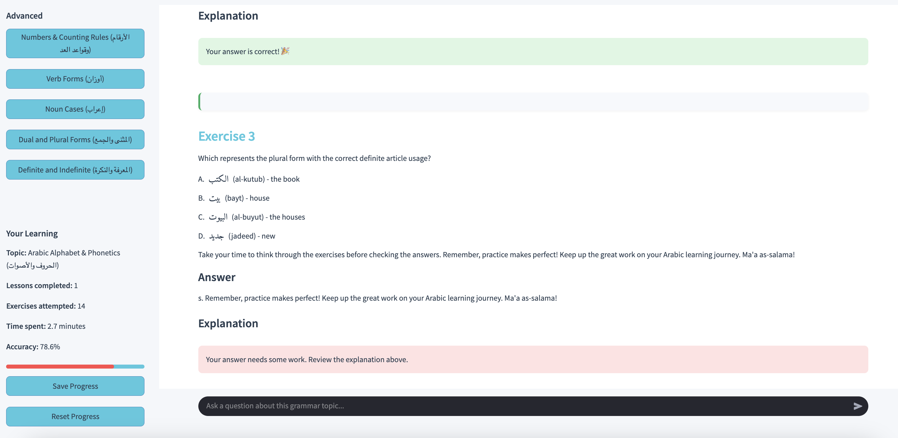

# 🇸🇦 Arabic Grammar Explainer | شارح قواعد اللغة العربية

<div align="center">
  
  
  
  
</div>

<div align="center">
  <p><i>An intelligent Arabic language tutor powered by AI agents</i></p>
  <p>تطبيق تفاعلي لتعلم قواعد اللغة العربية بطريقة سهلة وممتعة</p>
</div>

---

## ✨ Overview

The Arabic Grammar Explainer is an interactive Streamlit application that serves as a virtual language tutor, making Arabic grammar accessible to learners at all levels. Using a team of specialized AI agents powered by CrewAI, the app breaks down complex grammatical concepts into digestible explanations with practical examples and interactive exercises.

<div align="center">



















</div>

## 🌟 Key Features

- **📚 Comprehensive Grammar Topics** - Learn essential Arabic grammar concepts from basic to advanced
- **🤖 Intelligent AI Tutoring** - Receive personalized explanations tailored to your questions
- **✍️ Interactive Exercises** - Practice what you've learned with multiple-choice questions
- **🔄 Progress Tracking** - Monitor your learning journey with built-in progress metrics
- **💬 Conversational Interface** - Ask questions naturally and get clear, helpful responses
- **🎯 Immediate Feedback** - Understand why answers are correct or incorrect with detailed explanations
- **🎨 Beautiful UI** - A clean, intuitive interface designed for optimal learning

## 🧠 CrewAI Agent System

The application leverages CrewAI to orchestrate a team of specialized AI agents working together:

| Agent | Role | Responsibility |
|-------|------|----------------|
| **Arabic Grammar Expert** | Subject Matter Expert | Provides accurate, beginner-friendly explanations of grammar concepts with multiple examples |
| **Exercise Creator** | Educational Designer | Creates engaging multiple-choice exercises that reinforce understanding |
| **Language Tutor** | Coordinator & Guide | Delivers a cohesive learning experience with encouraging, supportive feedback |

## 🚀 Getting Started With Setup

### Prerequisites

- Python 3.9 or higher
- OpenAI API key

### Installation

1. **Create a virtual environment (recommended):**
   ```bash
   python -m venv venv
   source venv/bin/activate  # On Windows: venv\Scripts\activate
   ```

2. **Install dependencies:**
   ```bash
   pip install -r requirements.txt
   ```

3. **Set up environment variables:**
   - Copy the template: `cp .env.template .env`
   - Add your OpenAI API key to the `.env` file:
     ```
     OPENAI_API_KEY=your_api_key_here
     ```

### Running the Application

Start the Streamlit app with:
```bash
streamlit run app.py
```

The application will be available at `http://localhost:8501` in your web browser.

## 📖 How to Use

1. **Select a grammar topic** from the sidebar menu
2. **Read the introduction** to understand the basic concept
3. **Ask specific questions** about aspects you want to explore further
4. **Click "Show exercises"** when you're ready to test your understanding
5. **Complete the multiple-choice questions** and check your answers
6. **Review explanations** to deepen your understanding
7. **Track your progress** in the sidebar

## 📋 Available Grammar Topics

The application covers essential Arabic grammar concepts including:

- **Arabic Alphabet & Phonetics** (الحروف والأصوات)
- **Definite Article** (ال)
- **Gender: Masculine & Feminine** (المذكر والمؤنث)
- **Personal Pronouns** (الضمائر الشخصية)
- **Nominal vs. Verbal Sentences** (الجمل الاسمية والفعلية)
- **Past Tense Verb Conjugation** (تصريف الفعل الماضي)
- **Present Tense Verb Conjugation** (تصريف الفعل المضارع)
- **Question Words** (أدوات الاستفهام)
- **Attached Pronouns (Possession)** (ضمائر الملكية المتصلة)
- **Adjective-Noun Agreement** (مطابقة الصفة والموصوف)
- **Numbers & Counting Rules** (الأرقام وقواعد العد)
- **Prepositions** (حروف الجر)

## 🗂️ Project Structure

```
language-learning-agent/
├── app.py                 # Main Streamlit application
├── crew_setup.py          # CrewAI agents and tasks configuration
├── utils.py               # Utility functions for text processing
├── requirements.txt       # Project dependencies
├── .env.template          # Template for environment variables
└── README.md              # Project documentation
```

## 🛠️ Technologies Used

- **Streamlit**: For the web interface
- **CrewAI**: For orchestrating multiple AI agents
- **OpenAI**: For language model capabilities
- **Python**: Core programming language

---

<div align="center">
  <p>Made with ❤️ for Arabic language learners everywhere</p>
  <p>صنع بحب لمتعلمي اللغة العربية في كل مكان</p>
</div>

