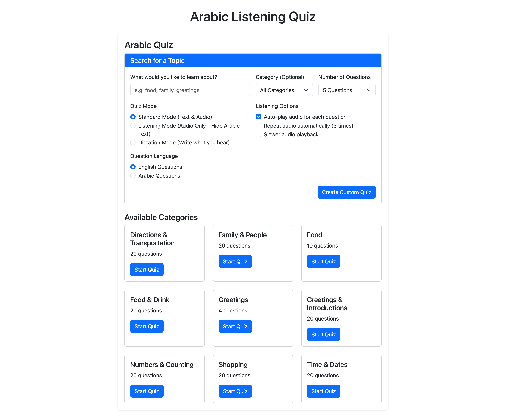
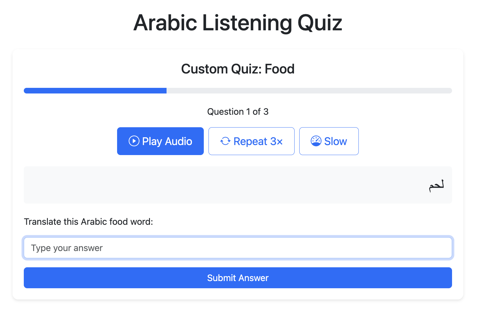

# 🔊 Language Listening Comprehension App

## 📋 Task Overview

**Objective:** Build a Language Listening Comprehension App

**Description:**
Create an app that helps students practice listening comprehension for language learning.

### 🔑 Key Tasks:
- Extract transcriptions from YouTube listening comprehension videos.
- Format the transcribed content for insertion into a vector store.
- Allow users to input a topic of interest.
- Retrieve contextually similar questions from the vector store based on the input topic.
- Generate a new listening comprehension question in the frontend UI.
- Synthesize audio so students can listen and practice.

---------------

## 💻 Technical Requirements:
* Text to Speech (TTS) eg. Amazon Polly, Google Text to Speech etc.
* (Optional) Speech to Text, (ASR) Transcribe. eg Amazon Transcribe, OpenWhisper
* Use Youtube Transcript API to download Transcript from Youtube
* LLM + Tool Use “Agent” to generate listening comprehension questions
* Use a vector store to store the transcript
* AI Coding Assistant eg. Amazon Developer Q + Windsurf
* Other AI Assistant - ChatGPT, Claude, DeepSeek R1, Google Gemini
* Frontend eg. Streamlit.
* Guardrails

---------------

## 🔧 Possible Technical Uncertainties

### General
* I only know a little Arabic so analyzing the quality of generated content will be a challenge!
* Finding good TSS for Arabic is going to be a challenge. 

### YouTube Transcription Extraction
* Can I pull transcripts for the target videos in Arabic?
* Are there legal risks in using YouTube transcripts and deriving content from them?
* What if videos doesn't have high-quality transcripts? How to mitigate this scenario?
* What tools/technologies can I use for Audio?
  * [Pydub](https://github.com/jiaaro/pydub)
* Will the generated audio sound natural and easy to understand?

### Vector Store Integration
* How to map vague or broad topics to useful content from the vector store?
* What tools to use for embeddings? 

---------------

## Domain knowledge acquired through technical uncertainty
Initially, my understanding of Arabic language processing tools was limited. Through this exercise, I learned that Arabic presents unique challenges for Text-to-Speech (TTS) as described below:

### 🎬 **YouTube Video Transcription**
- Some YouTube videos either lacked transcripts entirely or had poor-quality, auto-generated ones. To address this, I implemented logic to filter and only use videos with reliable **Arabic transcripts**.
- **Transcript formatting** was challenging. The LLM struggled to consistently convert raw transcripts into well-structured question formats. I had to iterate on the prompt multiple times to achieve reliable and meaningful output.
- I was also concerned about the legal constraints of using TouTube content. This problem can be mitigated by using content labeled for reuse or by contacting content creators for permissions. This led me to research about available datasets on platforms like Kaggle & open source Arabic dictionaries, to ensure reliable data sourcing. 

### 📚 **Pulling Data from the Vector Store**
- **Relevance issues:** The vector store didn’t always return semantically relevant results. Initial queries based on embeddings weren’t consistently aligned with the user's topic or intent.
- This occasionally resulted in **confusing or irrelevant practice questions**. I improved this by applying prompt engineering techniques—especially by providing few-shot examples to guide the LLM toward better question generation.

### 🔊 **Text-to-Speech (TTS)**
- Initially, my understanding of Arabic language processing tools was limited. Through this exercise, I learned that Arabic presents unique challenges for Text-to-Speech (TTS) output. I evaluated various TTS providers (e.g., **Google Cloud TTS**, **Edge TTS**, **Web Speech API**) to generate high-quality voice output. 
- The goal was to find a solution that supports **natural-sounding Arabic**, offers **dialect options**, and integrates easily into the app.
- I was quite impressed by Web Speech API that can generate voice pronunciation for each Arabic word which is supported in most modern browsers (Chrome, Edge, Safari). 

You can find my findings [here](../listening-comp/text-to-speech/README.md) 
I even tried different `edge-tts` voices. Check it out [here](../listening-comp/text-to-speech/edge-tts-app/README.md) - App credit: [HuggingFace: Edge-TTS-Text-to-Speech](https://huggingface.co/spaces/innoai/Edge-TTS-Text-to-Speech)

Overall, these uncertainties helped me acquire practical knowledge in:
* The challenges of Arabic speech and language processing
* Selecting appropriate tools and models for multilingual applications
* Designing fallback and filtering mechanisms for real-world data

---------------

## Solution Overview
This app has a robust system for generating Arabic quiz questions, either from YouTube content when available or from high-quality fallback content when extraction isn't possible.

This app provides different options:

### Quiz Mode
- Standard Mode (Text & Audio)
- Listening Mode (Audio Only - Hide Arabic Text)
- Dictation Mode (Write what you hear)

### Question Language:
- English Questions
- Arabic Questions

### Listening Options
- Auto-play audio for each question
- Repeat audio automatically (3 times)
- Slower audio playback

Searches for a topic in ChromaDB & generates questions based on similarity search

User attempts the quiz and submits answer. 

After submitting the answer, users gets feedback on submitted question.

User can play the audio with different settings.

User can choose to display question either in Arabic or English (based on their expertise level). In Dictation mode, user will provide the response based on what they listen.

App displays the final quiz results to the user.

---------------

## Tool Stack:
* Text to Speech: `gTTS` Google Text to Speech to generate speech/voice.
* Vector Store: ChromaDB - An open-source vector database designed for the efficient storage and retrieval of vector embeddings.
* `Sentence Transformers` (a.k.a. SBERT) - a Python module for accessing, using, and training state-of-the-art embedding and reranker models.
* Videos: YouTube Transcript Api to get video transcripts.
  
---------------

## How to use the app?

**Prerequites:**

1. Clone the app.
2. Create a virtual environment
3. Install dependencies
4. Create a `.env` file using the given `.env.example` file
5. Get YOUTUBE_API_KEY & copy it in your .env file.

## 1. YouTube Video Extractor
* Run `./run_extractor.sh --topic "arabic food vocabulary"` to generate questions for a specific topic
* Use `--videos` to control how many videos to process
* The questions will be saved to JSON files and added to the vector store

## 2. Quiz App
* Run `python app.py` to start the quiz app
* The app will run on `http://localhost:5000`
* Use the search functionality to find questions related to specific topics. The app will use both the predefined questions and any extracted from YouTube.

## 3. Explore Different Topics:
View available topics with `./run_extractor.sh --list-topics`

Process all topics at once with `./run_extractor.sh --process-all`

For each topic, it will:
* Search YouTube for relevant videos
* Try to extract Arabic phrases and their translations
* Generate quiz questions in various formats (multiple choice, true/false, fill-in-the-blank)
* Save the questions to the appropriate JSON file (e.g., greetings.json, food.json, etc.)
* Add the questions to the ChromaDB vector store for semantic search

## Limitations

- Translation quality depends on the accuracy of the translation model
- Question generation may produce imperfect questions depending on the content
- The first run may be slow as it downloads necessary language models