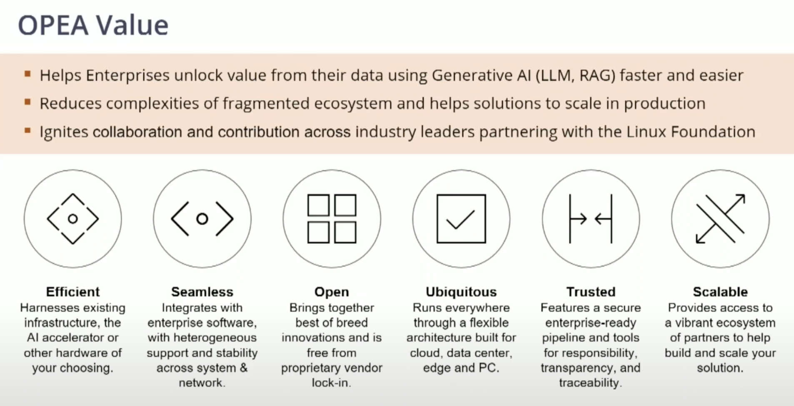
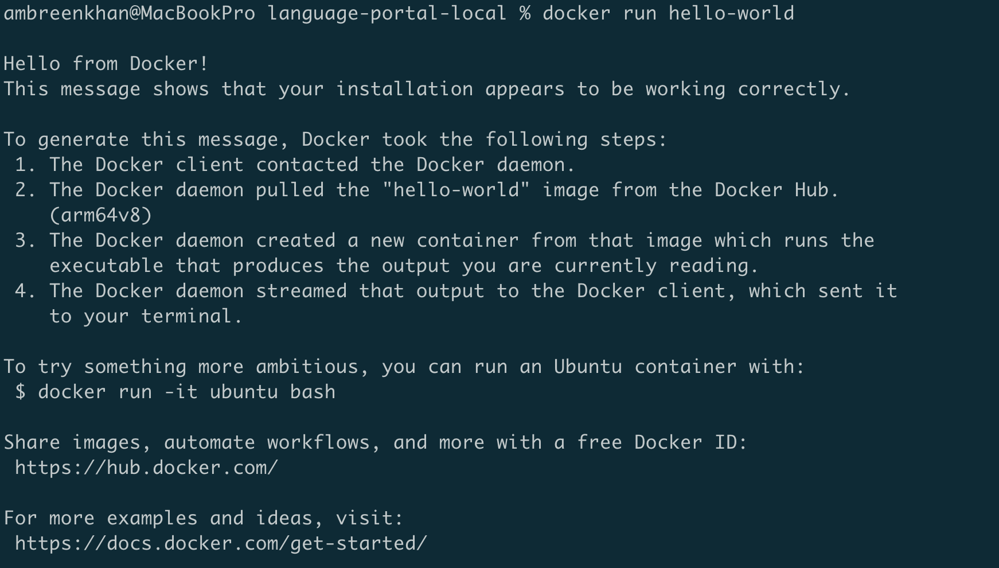
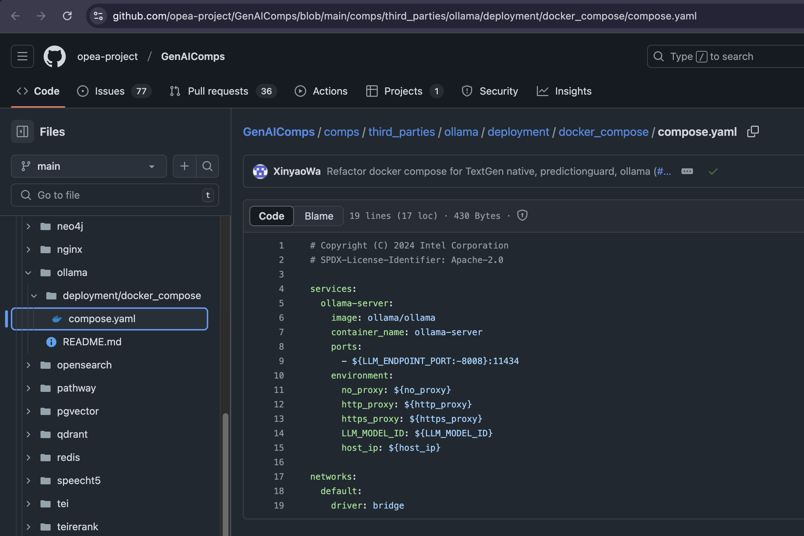
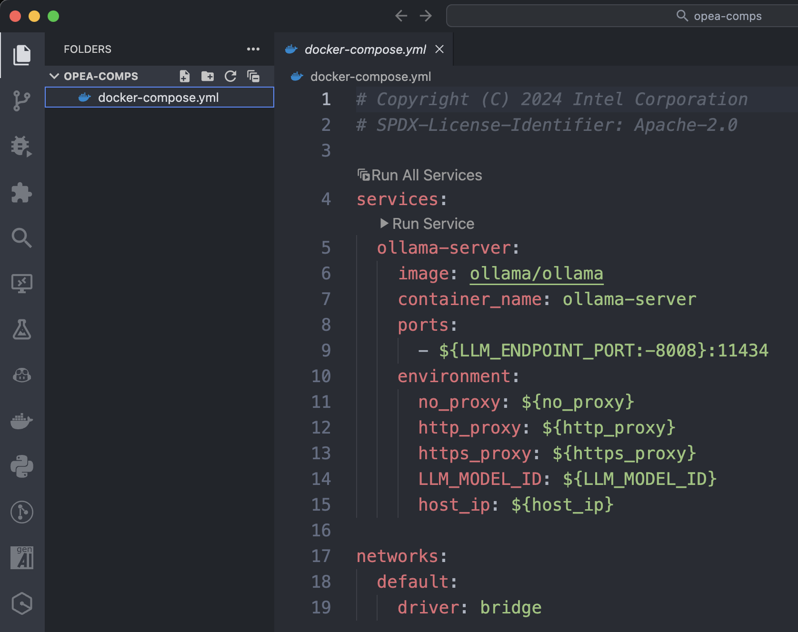
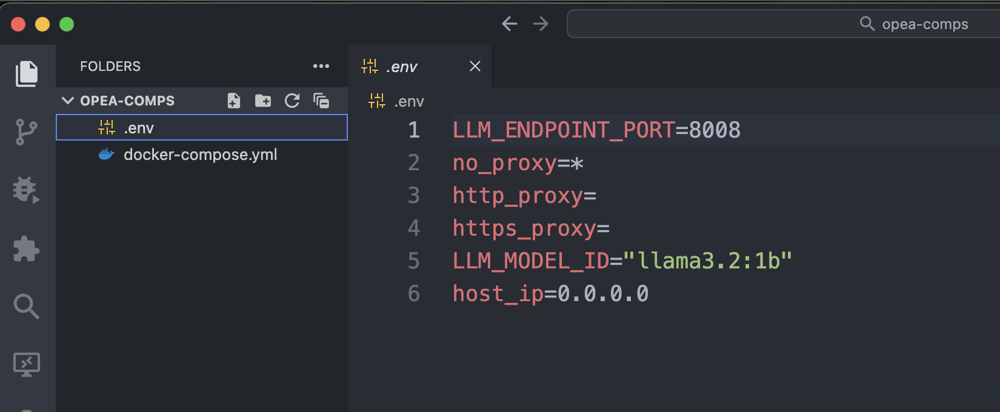

# OPEA Comps: Mapping My Journey Through the GenAI Crossroads

The Open Platform for Enterprise AI (OPEA) is an initiative introduced by Intel and its partners to simplify the adoption of generative AI (GenAI) in businesses. OPEA provides a structured framework to implement RAG and other GenAI workflows, making it easier for developers to build AI solutions tailored to their organization's needs.

## Why OPEA?
Since ChatGPT's debut approximately a year and a half ago, enterprises across industries have been eager to harness generative AI's potential for productivity gains. However, they face significant hurdles in moving from concept to production. When navigating the fast-changing landscape of Generative AI, multiple paths emerge — each promising innovation but also posing challenges. 

- Complex development and deployment processes
- Difficulty in measuring return on investment
- Security concerns, particularly regarding corporate data protection
- The need for comprehensive end-to-end use case support

## How OPEA Helps?
OPEA brings together existing components and ecosystem players. This platform:

- Helps Enterprises unlock value from their data using Generative AI (LLM, RAG) faster and easier  
- Reduces complexities of fragmented ecosystem and helps solutions to scale in production
- Reduces the time, cost, and risk associated with enterprise AI implementations.  
- Ignites collaboration and contribution across industry leaders partnering with the Linux Foundation  

The platform already offers reference flows for common use cases like chat, Q&A, and summarization, with plans to expand into more complex scenarios involving multi-stage AI pipelines.


(Image from opea.dev)

## What is GenAIComps?
GenAIComps, short for Generative AI Components, is an open-source project under the Open Platform for Enterprise AI (OPEA) initiative. It offers a collection of containerized microservices designed to facilitate the development and deployment of enterprise-grade Generative AI applications. These microservices serve as modular building blocks, enabling developers to construct complex AI workflows, such as Retrieval-Augmented Generation (RAG) pipelines, with greater ease and flexibility. By abstracting infrastructure complexities, GenAIComps allows for seamless scaling and integration of AI services within cloud-native environments. The project supports various hardware platforms, including Intel® Xeon® processors and Intel® Gaudi® accelerators, ensuring optimized performance across different infrastructures. 

## Setting Up Your Local Environment
Now let's give OPEA a try. We'll set it up on a local environment (I used Apple M1 Pro with16 GB RAM for this experiment)

### Prerequisite:

**Docker**: This platform is all about containerization. To install Docker, follow [Docker's official installation guide](https://docs.docker.com/get-docker/).  

Once installed, verify your docker installation by running `docker run hello-world`


### Run Ollama Service Container

You can run the **Ollama** container using **Docker Compose**. Please follow the below steps: 

#### **1.Get Ollama Docker Compose YAML File** 
Get [Ollama YAML configuration](https://github.com/opea-project/GenAIComps/blob/main/comps/third_parties/ollama/deployment/docker_compose/compose.yaml) from GenAIComps Github repo.



#### **2. Save the Docker Compose YAML File**
Save Ollama YAML configuration as `docker-compose.yml` in a directory.



#### **2. Set Up Environment Variables**
Before running the container, you need to set up an `.env` file or define environment variables in your shell.

Create a `.env` file in the same directory:

```sh
LLM_ENDPOINT_PORT=8008
no_proxy=*
http_proxy=
https_proxy=
LLM_MODEL_ID="llama3.2:1b"
host_ip=0.0.0.0
```



#### **3. Run the Container**
Now, use the following command to start the Ollama container:

```sh
docker compose up -d
```

This runs the container in detached mode (`-d`). Note that running a container in detached mode (-d) means that the container runs in the background without tying up your terminal session. This allows you to keep using the terminal for other tasks while the container continues running.


#### **4. Verify the Container is Running**
Check the running containers with:

```sh
docker ps
```

You should see `ollama-server` running.


#### **5. Test the Ollama API**
As the container is running, test if Ollama is accessible:

```sh
curl http://localhost:8008
```

If it returns a response, your container is working.


You can also verify the Ollama server's status by accessing it through your browser.


#### **6. Stop the Container**
If you need to stop the container:

```sh
docker compose down
```
---

Note: This process only sets up the Ollama server. To chat with a model, you must download your desired model inside the container. Otherwise, you’ll encounter an error like {"error":"model 'llama3' not found"}, indicating that the Ollama container does not have the llama3 model installed. To resolve this, let’s manually pull the model inside the container or specify a different one.

### Pull the Model Inside the Running Container**
1. **Access the running container:**
   ```sh
   docker exec -it ollama-server bash
   ```
   
2. **Download the required model (e.g., `llama3`):**
   ```sh
   ollama pull llama3
   ```


3. **Verify the Model Exists**
After restarting, you can check the available models in the container:
```sh
docker exec -it ollama-server ollama list
```


4. **Exit the container:**
   ```sh
   exit
   ```

Now, restart the container:
```sh
docker restart ollama-server
```


---

### **Alternate: Pre-Pull the Model Before Running the Container**
Instead of downloading it inside the container, you can **pull the model on your host system** and mount it to the container.

1. **Pull the model locally:**
   ```sh
   ollama pull llama3
   ```

2. **Modify your `docker-compose.yml` to mount the local Ollama model storage:**
   ```yaml
   services:
     ollama-server:
       image: ollama/ollama
       container_name: ollama-server
       ports:
         - ${LLM_ENDPOINT_PORT:-8008}:11434
       environment:
         no_proxy: ${no_proxy}
         http_proxy: ${http_proxy}
         https_proxy: ${https_proxy}
         LLM_MODEL_ID: ${LLM_MODEL_ID}
         host_ip: ${host_ip}
       volumes:
         - ~/.ollama:/root/.ollama  # Mount local Ollama storage
   ```

3. **Restart the container:**
   ```sh
   docker compose up -d --force-recreate
   ```

This ensures that the container has access to your locally downloaded models.

---

### Chat with the running server
Ollama has a REST API for running and managing models. If you want to use the available API, you can do a quick curl command to check that the API is responding.

```sh
curl http://localhost:8008/api/generate -d '
{ 
 "model": "llama3.2:1b", 
 "prompt": "Why is the sky blue?", 
 "stream": false 
}'
```


Note: By default, Ollama sets itself up as a local server on port 11434. As we have provided a custom port so it’s running on port 8008.

To interact with the LLM in a conversational style:
```sh
curl http://localhost:8008/api/chat -d '{
  "model": "llama3.2:1b",
  "stream": false, 
  "messages": [
    { "role": "user", "content": "why is the sky blue?" }
  ]
}'
```


### Running Programmatically​

You can interact with Ollama through its API, which includes SDKs for JavaScript and Python. See the [official API docs](https://github.com/ollama/ollama/blob/main/docs/api.md) for more information.​

Let’s access the API programmatically using Python. Create a file named chat.py & copy the below code:

```py
import requests

def generate_completion(prompt, model="llama3.2:1b"):
    """
    Generate a completion using Ollama's API
    """
    url = "http://localhost:8008/api/generate"

    data = {
        "model": model,
        "prompt": prompt,
        "stream": False,  # Set to True if you want to stream the response
    }

    response = requests.post(url, json=data)
    return response.json()

print(generate_completion("Why is the sky blue?"))
```


#### **Useful Links:**
- Official Website: [opea.dev](https://opea.dev/?utm_source=chatgpt.com)  
- [Github: OPEA - Open Platform for Enterprise AI](https://github.com/opea-project)
- [Github: GenAIComps](https://github.com/opea-project/GenAIComps/tree/main) 
- [Intel: Introducing The Open Platform for Enterprise AI](https://www.intel.com/content/www/us/en/developer/articles/news/introducing-the-open-platform-for-enterprise-ai.html?utm_source=chatgpt.com)
- [YouTube: Introducing Open Platform for Enterprise AI - Ramakrishna Karamsetty & Arun Gupta, Intel Corporation](https://www.youtube.com/watch?v=Q5uTvmv5fZU)
- [TGI LLM Microservice ](https://github.com/opea-project/GenAIComps/tree/main/comps/third_parties/tgi)
