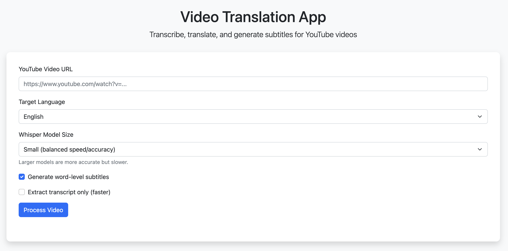
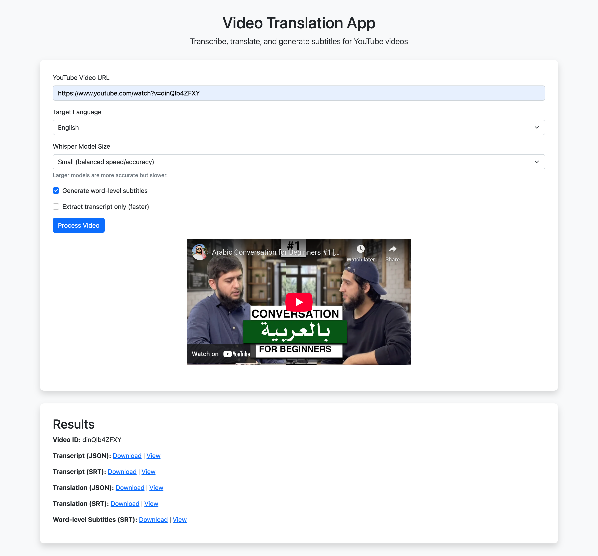
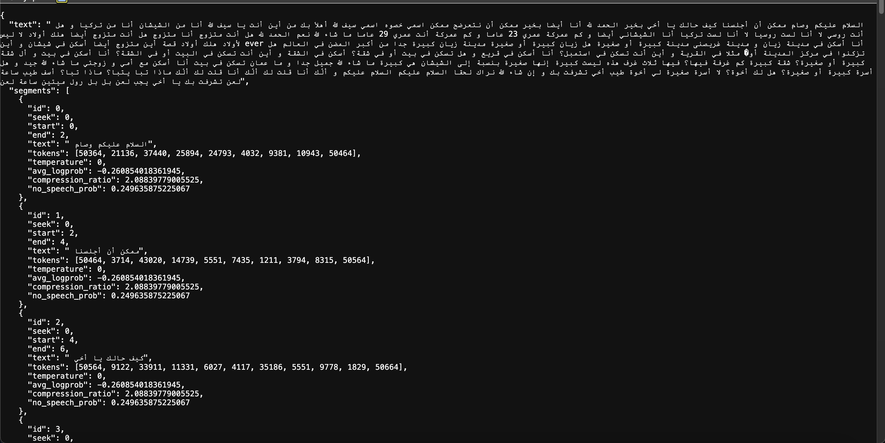
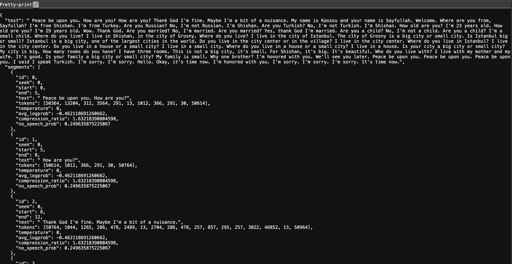
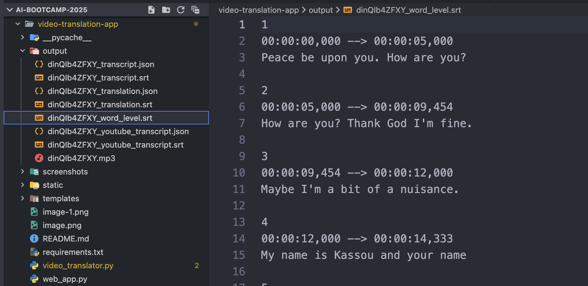

# Video Translation App

## Overview

The Video Translation App is a web application that allows users to transcribe and translate YouTube videos using OpenAI's Whisper model. It provides a user-friendly interface for processing videos and generating subtitles in multiple languages.



## Features
- Access YouTube Video using YouTubeTranscriptApi
- Transcribe the audio and translate the transcript using OpenAI Whisper
- Generate subtitle files from the transcript (SRT format)
- Word-level timing alignment for precise subtitles

> **Note:** OpenAI Whisper can only translate from other languages to English. The model does not support translation to other target languages natively. To translate to languages other than English, you would need to integrate an additional translation service.

## Installation

### Prerequisites
- Python 3.8 or higher
- FFmpeg (required for audio processing)
- yt-dlp (for downloading YouTube videos)

### Setting up the environment

#### Create a virtual environment
```sh
# Using venv
python -m venv venv

# Or using conda
conda create -n video-translator python=3.10
```

#### Activate the environment
```sh
# Using venv
# On Windows
venv\Scripts\activate
# On macOS/Linux
source venv/bin/activate

# Or using conda
conda activate video-translator
```

#### Install dependencies
```sh
pip install -r requirements.txt
```

#### Install FFmpeg and yt-dlp
```sh
# On macOS with Homebrew
brew install ffmpeg yt-dlp

# On Ubuntu/Debian
sudo apt update
sudo apt install ffmpeg
pip install yt-dlp

# On Windows with Chocolatey
choco install ffmpeg yt-dlp
```

## Usage

### Command Line Interface

```bash
# Basic usage
python video_translator.py https://www.youtube.com/watch?v=VIDEO_ID

# Specify target language
python video_translator.py https://www.youtube.com/watch?v=VIDEO_ID --target-language french

# Use a different model size
python video_translator.py https://www.youtube.com/watch?v=VIDEO_ID --model-size medium

# Extract transcript only (faster)
python video_translator.py https://www.youtube.com/watch?v=VIDEO_ID --transcript-only

# Don't generate word-level subtitles
python video_translator.py https://www.youtube.com/watch?v=VIDEO_ID --no-word-level
```

### Web Application

```bash
python web_app.py
```

Then open your browser and navigate to `http://localhost:5000`

## How It Works

1. **Video Access**: The app extracts the video ID from a YouTube URL and uses the `youtube-transcript-api` to download available transcripts.

2. **Audio Processing**: If needed, the app downloads the audio from the YouTube video using `yt-dlp` for further processing.

3. **Transcription**: OpenAI's Whisper model is used to transcribe the audio. You can choose different model sizes based on your needs (tiny, base, small, medium, large).

4. **Translation**: Whisper can translate content from any supported language to English only. This is a fundamental limitation of the Whisper model - it can transcribe audio in many languages, but its translation capability is limited to outputting English. If you need translation to other target languages, you would need to integrate an additional translation service (like Google Translate API, DeepL, etc.).

5. **Subtitle Generation**: The app generates SRT subtitle files from both the original transcript and the translation.

6. **Word-Level Timing Alignment**: The app aligns timing at the word level using two approaches:
   - For models that provide word-level timestamps: The app directly uses these timestamps
   - For models without word-level timestamps: The app estimates word timing by dividing the segment duration by the number of words

7. **Web Interface**: A Flask-based web application provides an easy-to-use interface for all functionality.

## Output Files

The app generates several output files for each processed video:

- `VIDEO_ID_transcript.json`: Original transcript in JSON format
- `VIDEO_ID_transcript.srt`: Original transcript in SRT format
- `VIDEO_ID_translation.json`: Translated transcript in JSON format (if applicable)
- `VIDEO_ID_translation.srt`: Translated transcript in SRT format (if applicable)
- `VIDEO_ID_word_level.srt`: Word-level aligned subtitles in SRT format (if enabled)

## App in Action










