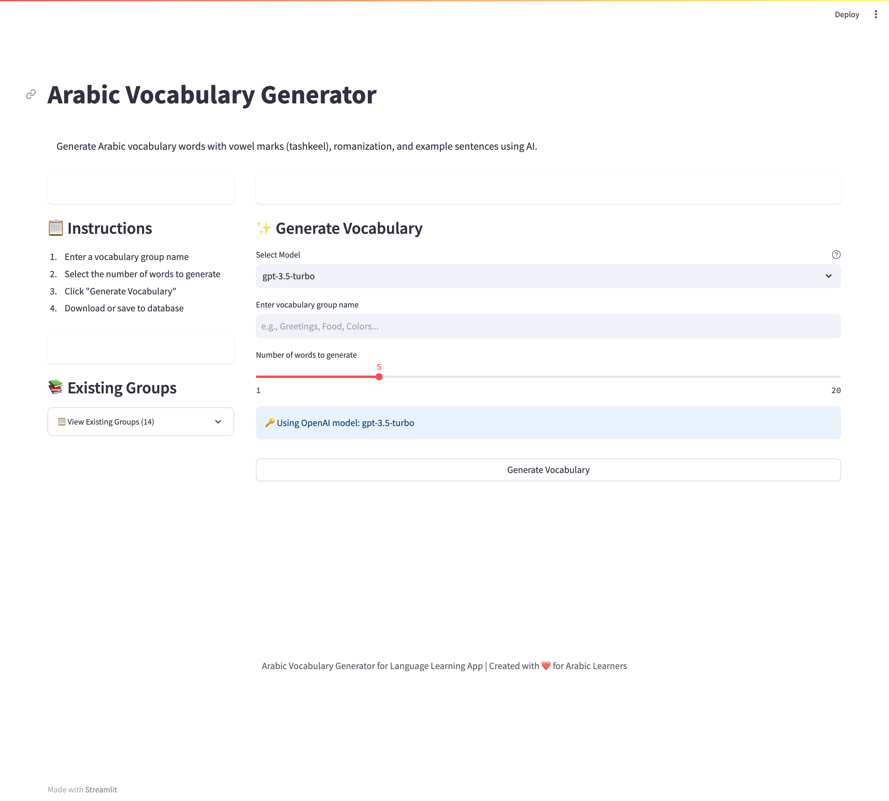
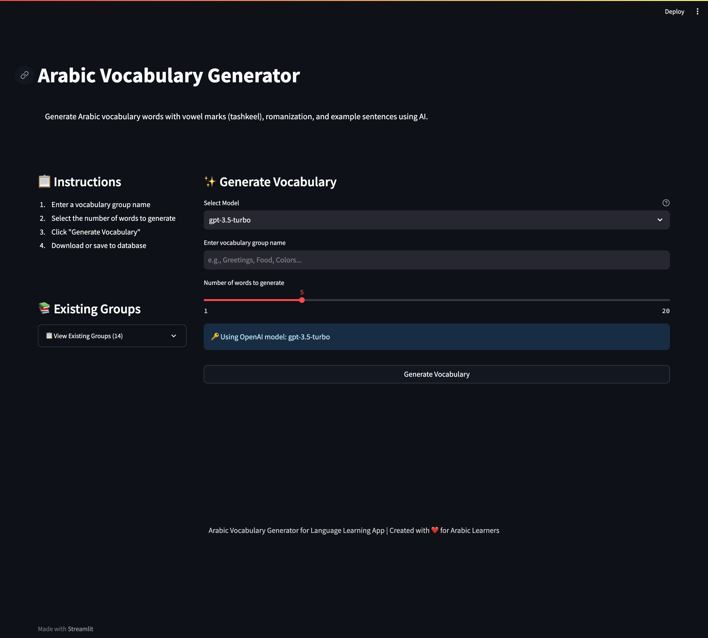
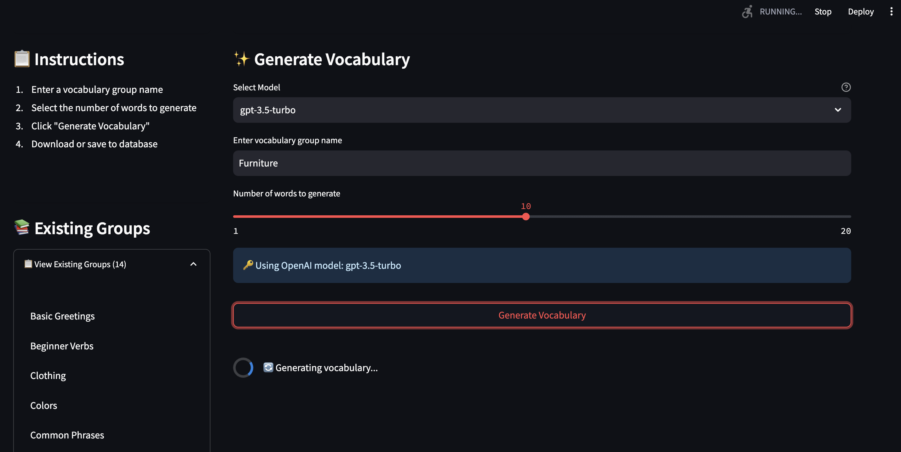
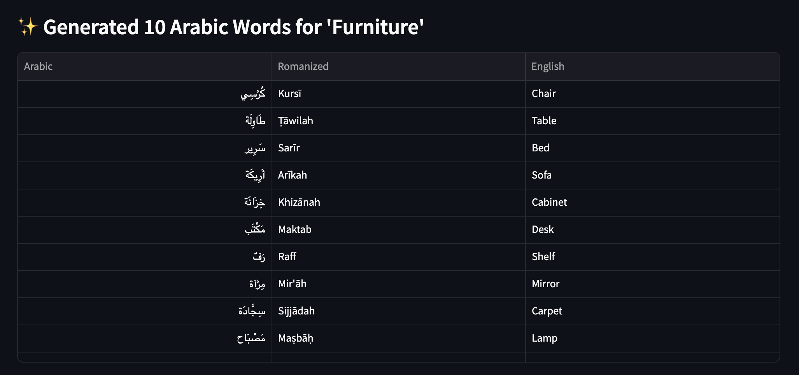
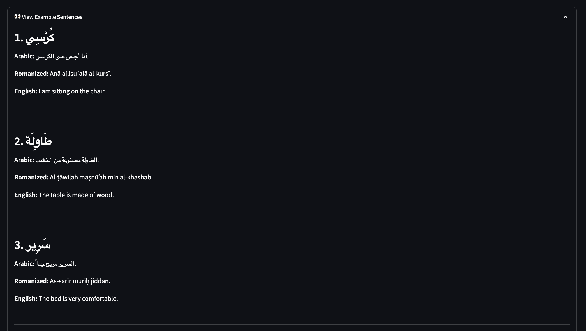
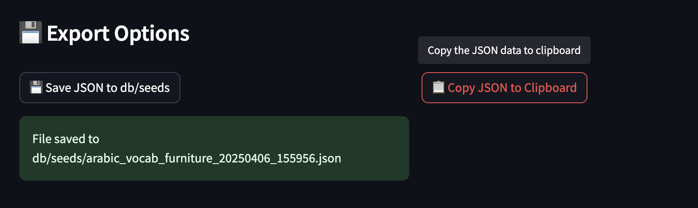
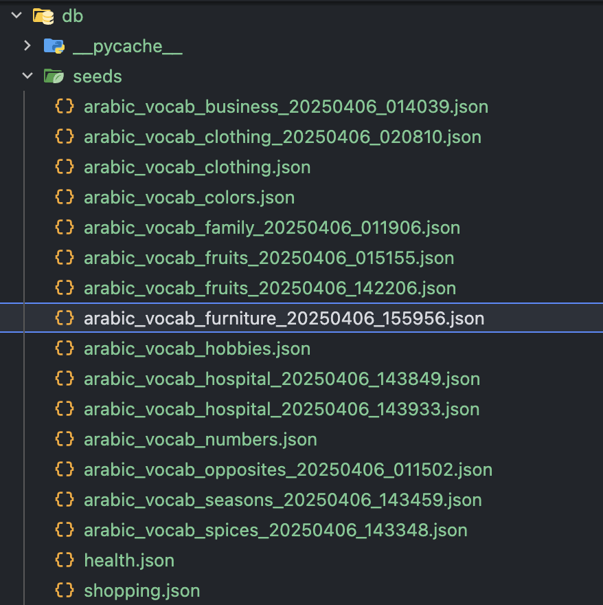
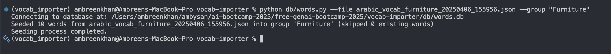
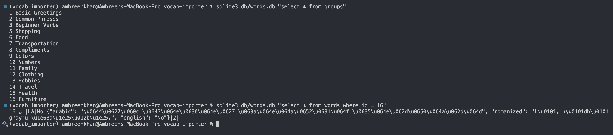
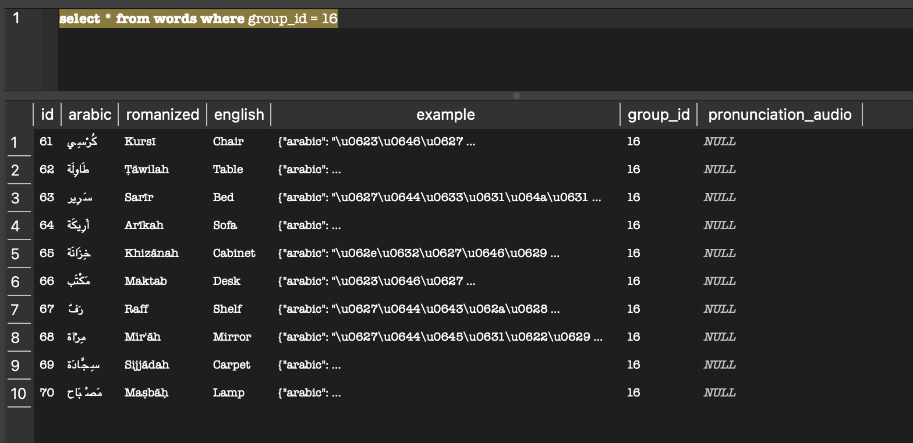

## Business Goal

* Create an internal facing tool to generate Arabic vocabulary 
* Be able to export the generated vocab to json for later import
* Be able to import the vocabulary from the json files into DB


## Tech Choice

* Prototyping framework: Streamlit
* LLM: 
    * Managed/Serverless LLM API: OpenAI
    * Local LLM serving the model via Ollama

## Project Structure

arabic_vocabulary_generator/
├── app.py               # Main application file
├── styles.css           # External CSS file
├── db/
│   ├── words.db         # SQLite database
│   └── seeds/           # Directory for JSON export
├── .streamlit/          # Streamlit configuration
│   └── secrets.toml     # API keys and secrets
└── requirements.txt     # Project dependencies

## Features

1. **Configuration Options**:
   - OpenAI API key input
   - Model selection (GPT-4, GPT-3.5-turbo)
   - Customizable vocabulary groups

2. **Vocabulary Generation**:
   - Select vocabulary category (greetings, food, family, etc.)
   - Choose number of words to generate

3. **Results Display**:
   - Table view of generated words
   - Collapsable view of example sentences
   - Full JSON view (Raw JSON)
   - Download options for the generated data

## Running the Application

```sh
streamlit run app.py
```

## How to Use Vobaculary Importer

1. Run the app with `streamlit run app.py`
2. Enter your OpenAI API key in the `.streamlit/secrets.toml` folder
3. Select a vocabulary group and the number of words to generate
4. Click "Generate" to create vocabulary in the correct JSON format
5. Download the JSON file to `db/seeds` folder
6. Import the data into your database using Python script 

## Setup Instructions:

### Environment Setup: 
1. Create a folder & navigate to the folder
```sh
cd vocab-importer
```
2. Create & activate a virtual environment:
```sh
conda create --name <env_name> python=<version>
conda create --name vocab_importer python=3.11.7
conda activate vocab_importer
```
3. Install Dependencioes
```sh
pip install -r requirements.txt
```
4. Configure API keys: 
Create a .streamlit/secrets.toml file in the project root with API keys for LLM (please check `secrets.toml.example` for a reference.)

```
[openai]
api_key = "Your API key here"
```
## How to Insert Data into the Database

1. List available JSON files
```sh
python db/seeds/words.py --list
```

2. Run Python script to seed data from specific file into a specific group
```sh
python db/words.py --file arabic_vocab_food.json --group "Food"
```

### Running script to populate the downloaded JSON files to local SQLite3 DB


### Common Terminal Commands

#### Database
DATABASE_PATH=data/words.db

#### Database Commands

1: Launch SQLite shell and run SQL there
```sh
sqlite3 db/words.db
```

2. Check Schema:
```sh
sqlite3 db/words.db ".schema words"
```

3. Check data available in `groups` table
```sh
sqlite3 db/words.db "select * from groups"
```

4. Check data available in `groups` table
```sh
sqlite3 db/words.db "select * from words"
```

Type .exit to leave.

## Vocabulary Importer in Action






















